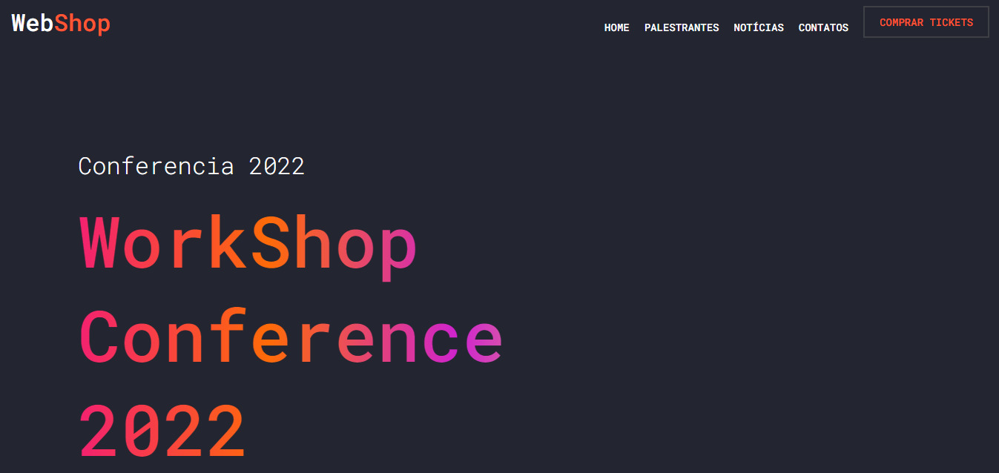

<h1 align="center">Webshop </h1>

Projeto pessoal criado para treinar HTML, CSS, JavaScript.  

  <a href="#-tecnologias">Tecnologias</a>&nbsp;&nbsp;&nbsp;|&nbsp;&nbsp;&nbsp;
  <a href="#-projeto">Projeto</a>&nbsp;&nbsp;&nbsp;|&nbsp;&nbsp;&nbsp;
  <a href="#-layout">Layout</a>

 

  

## 🚀 Tecnologias

Esse projeto foi desenvolvido com as seguintes tecnologias:

- HTML e CSS
- JavaScript
- Git e Github

## 💻 Projeto

O "Webshop" é um site para ajudar um evento fictício.

- [Acesse o projeto finalizado, online](https://pdro-h0.github.io/webshop-/)

## 🔖 Layout

Você pode visualizar o layout do projeto através [DESSE LINK](https://preview.colorlib.com/#workshop).

---

Feito com ♥ by Pedro Henrique